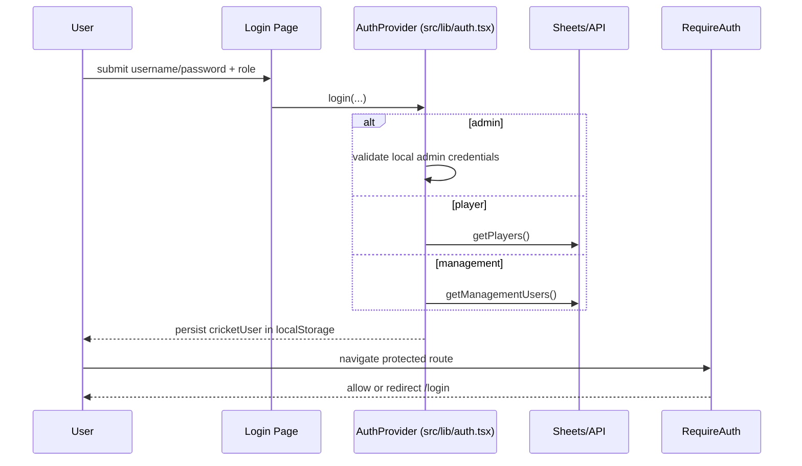
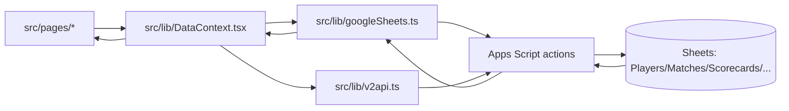

# Architecture Data Flow (Quick View)

This page gives a fast, implementation-oriented view of how data moves across the app.

## 1) App topology
```mermaid
flowchart TD
  U[User Browser] --> R[React App (src/pages + src/components)]
  R --> C[Context + Query Layer (src/lib/DataContext.tsx)]
  C --> V1[v1 API client (src/lib/googleSheets.ts)]
  C --> V2[v2 API client (src/lib/v2api.ts)]
  V1 --> GAS[Google Apps Script Web App]
  V2 --> GAS
  GAS --> GS[(Google Sheets Tabs)]
```

## 2) Auth and route protection flow


## 3) Match/stat data flow


## 4) Ops pointers
- Keep Sheets headers/tabs synced before enabling new frontend features.
- Keep Apps Script deployment version current after backend script changes.
- Validate auth + read/write + email flows after each deployment.
